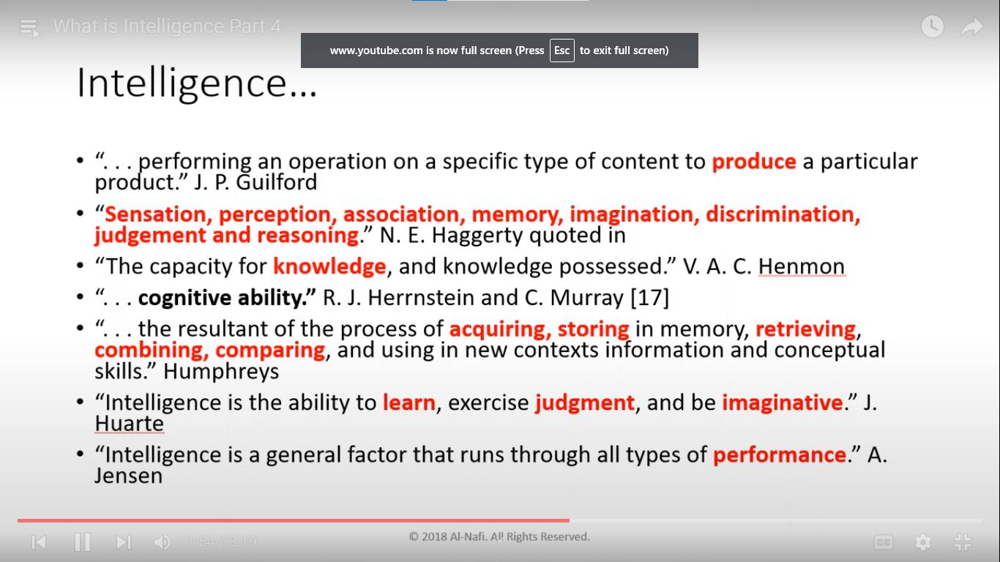

# _**Practice Markdown**_
---

In this markdown file, we are practicing following things:

[1. Headings](#-1.-Headings)\
[2. Quoted Text](#-2.-Quoted-Text)\****
[3. Face of Text](#3-face-of-text)\
[4. Bullet Points](#4-bullet-points--list)\
[5. Line Breaks](#5-line-line-breaks)\
[6. Hyper links](#6-hyperlinks)\
[7. images](#7-images)\
[8. Block of code](#8-block-of-code)\
[9. Tables](#9-tables)

# 1. Headings
# Heading 1
## Heading 2
### Heading 3

# 2. Quoted Text

> quoted text
>
> Again quoted text


# 3. Face of Text

> Bold

**Bold Text**

__Bold Text__

> Italic

*Italic text*

_Italic text_

> Bold and Italic

***Bold and Italic Text***

___Bold and italic text___


# 4. Bullet points / List

> Unordered List with '-'

- Practice 1
- Practice 2
    - Practice 2a
        - Practice 2a1
- Practice 3
- Practice 4

> Unordered List with '*'

* Practice 1
* Practice 2
    * Practice 2a
        * Practice 2a1
* Practice 3
* Practice 4

> Unordered List with '+'

+ Practice 1
+ Practice 2
    + Practice 2a
        + Practice 2a1
+ Practice 3
+ Practice 4


> Numbered List

1. Day 1
2. Day 2
    1. Day 2a
     
# 5. Line, Line Breaks

This is before first line

---

This is after first line

___

This is after second line

***


# 6. Hyperlinks

> Plain link

<https://www.youtube.com/c/codanics/playlists>

> Hyperlink a text

This is link for [Codanics](https://www.youtube.com/c/codanics)

> Creating a key for link to use multiple times

[c]:https://www.youtube.com/c/codanics

This channel can be found [here][c]

# 7. Images



<!-- Comment this text -->


# 8. Block of Code

In python, we use `print('Inside print function')` to print anything to console

> to create a block of code 

```
This is our block of code
```

> Make a language specific block of code

```python
x = 4+3
y = 5-2
z = x+y
print(calculator)
```

```C
x = 4+3
y = 5-2
z = x+y
printf('Calculator)
```

```C#
x = 4+3
y = 5-2
z = x+y
console.writeline('Calculator')
```

# 9. Tables

| class | attribute 1| attribute 2 |
|:---:|:---:|:---:|
|first|1.2|2.3|
|second|2.2|1.9|
|third|3.1|0.9|
|fourth|3.3|2.4|

# 10. Table of contents
> Already done in the start

11. Install extension
> Installed the following extensions
1. Markdown All
2. Markdown **PDF**
3. Markdownlint
4. Markdown Shortcuts

